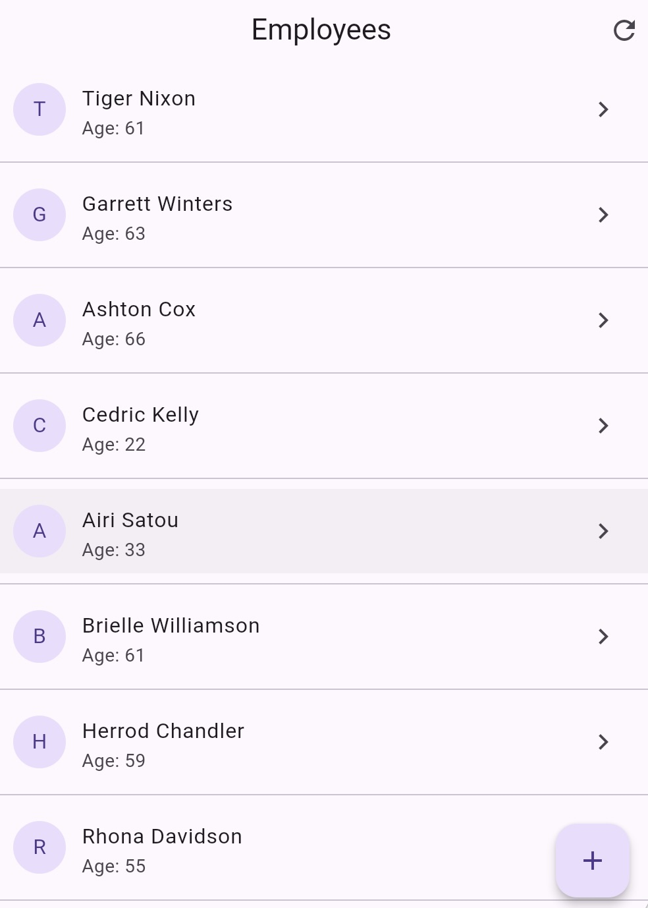

# Employee Management App

A Small Flutter MVVM application for managing employee records with full CRUD functionality and Optimistic UI.
API: https://dummy.restapiexample.com/



## Features

### 1. Pages
- **Employee List** - View all employees with refresh button
- **Employee Details** - View detailed information
### 2. Actions
- **Create** - Add a new employee
- **Update** - Edit existing employee information
- **Delete** - Remove an existing employee with confirmation
### 3. Optimistic UI
All CRUD operations use Optimistic UI for instant feedback:
- **Create**: Add immediately with temp ID → Replace with real ID on success
- **Update**: Apply changes instantly → Rollback on failure
- **Delete**: Remove instantly → Restore on failure
### 4. Error and Success Handling
- **API Level**: Map HTTP status codes to user-friendly messages.
- **Application Level**: Distinction between "hard" errors (loading failure) and "soft" errors (CRUD failure). Hard errors use a specialized `ErrorView` with retry, while soft errors use Snackbars.

- **Success messages**: Clear, non UI blocking feedback in case of success - snackbar style

## Architecture

```
lib/
├── models/
│   └── employee.dart          # Data model
├── services/
│   └── api_service.dart       # API communication
├── viewmodels/
│   └── employee_view_model.dart  # Business logic & state
└── views/
    ├── employee_list_screen.dart
    ├── employee_detail_screen.dart
    ├── employee_form_screen.dart
    └── widgets/
        └── error_view.dart    # Reusable error component
```

## Tech Stack

| Component | Technology |
|-----------|------------|
| Framework | Flutter 3.10+ |
| State Management | Provider + ChangeNotifier |
| Architecture | MVVM |
| HTTP Client | http package |

## Getting Started

### Prerequisites

- VSCode: 1.108.0
- Flutter SDK 3.10.7+
- cupertino_icons: ^1.0.8
- http: ^1.6.0
- provider: ^6.1.5

### Setup

1. **Clone the repository**
   ```bash
   git clone <repo-url>
   cd flutter_employee
   ```

2. **Install dependencies**
   ```bash
   flutter pub get
   ```

4. **Run the app**
   ```bash
   flutter run
   ```