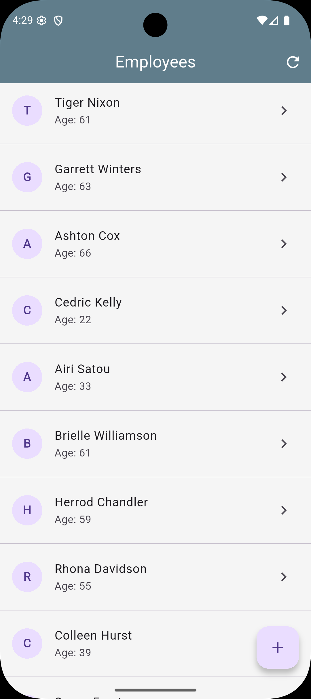
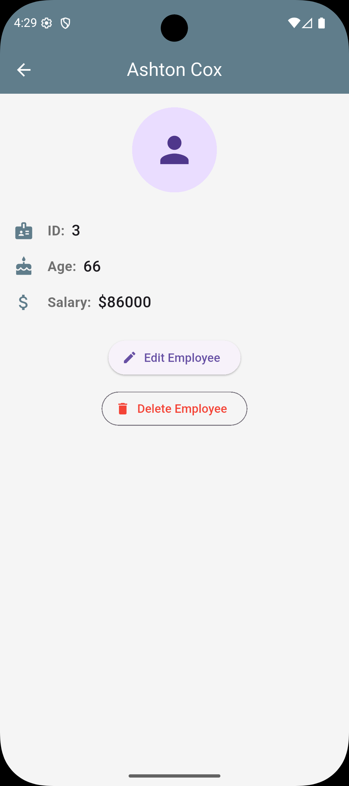
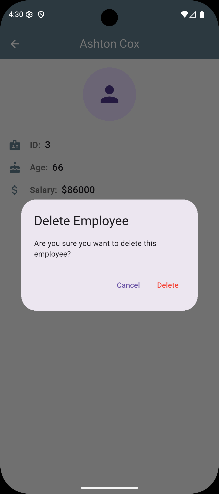
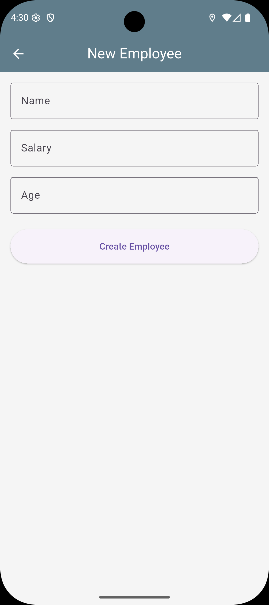
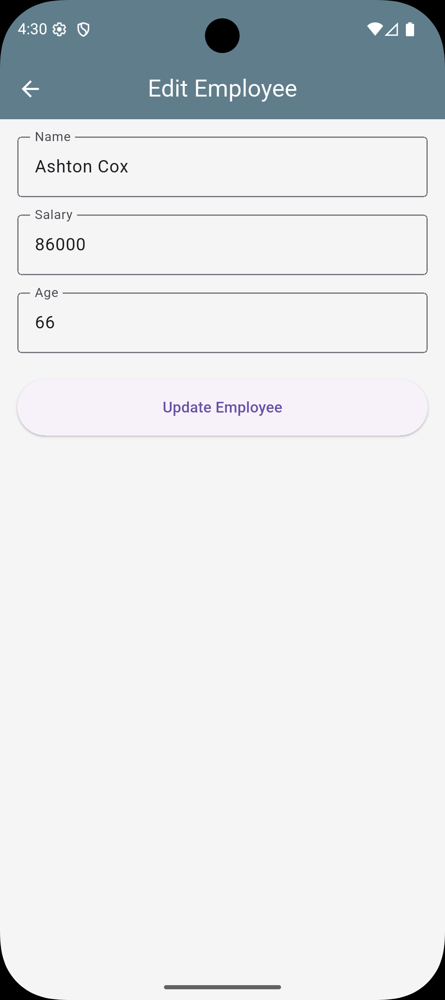
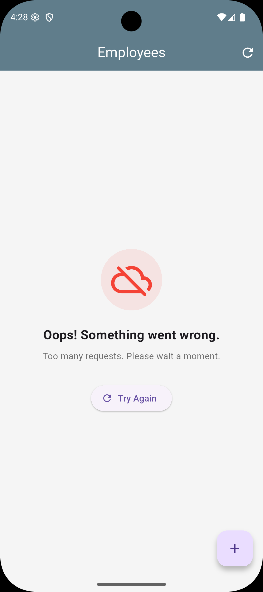
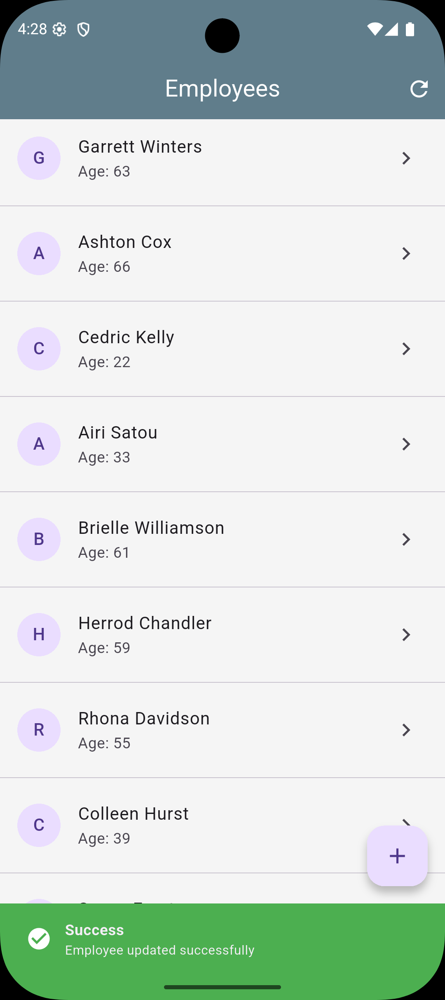
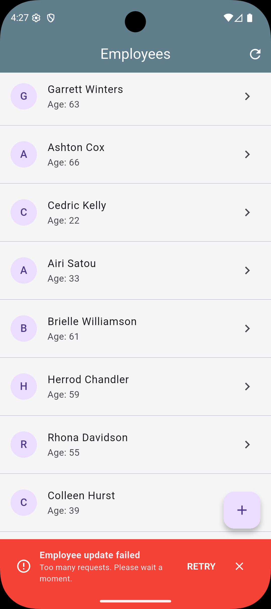

# Employee Management App

A Small Flutter MVVM application for managing employee records with full CRUD functionality and Optimistic UI.
API: https://dummy.restapiexample.com/

## Screenshots

| Employee List | Employee Details | Delete Confirmation |
| :---: | :---: | :---: |
|  |  |  |

| Add Employee | Edit Employee | Error View - Blocking |
| :---: | :---: | :---: |
|  |  |  |

| Success Feedback | Error Feedback - Non Blocking |
| :---: | :---: |
|  |  |

## Features

### 1. Pages
- **Employee List** - View all employees with refresh button
- **Employee Details** - View detailed information
### 2. Actions
- **Create** - Add a new employee
- **Update** - Edit existing employee information
- **Delete** - Remove an existing employee with confirmation
### 3. Optimistic UI
All CRUD operations use Optimistic UI for instant feedback:
- **Create**: Add immediately with temp ID → Replace with real ID on success
- **Update**: Apply changes instantly → Rollback on failure
- **Delete**: Remove instantly → Restore on failure
### 4. Offline Support (Hive)
- **Local Caching**: The application automatically caches the employee list using **Hive** local storage.
- **Deep Sync**: Create, Update, and Delete operations are atomically synced with the local box upon server success, ensuring local data is always current.
- **Graceful Fallback**: If the server is unreachable, the app seamlessly falls back to the local cache.

### 5. Error and Success Handling
- **API Level**: Map HTTP status codes to user-friendly messages.
- **Application Level**: Distinction between "hard" errors (loading failure) and "soft" errors (CRUD failure). Hard errors use a specialized `ErrorView` with retry, while soft errors use `CrudStatusSnackBar` with retry and dismiss actions.

- **Success messages**: Clear, non UI blocking feedback in case of success - via `CrudStatusSnackBar`.

## Architecture

```
lib/
├── models/
│   └── employee.dart            # Data model (Hive annotated)
├── services/
│   ├── api_service.dart         # API communication
│   └── local_database_service.dart # Hive caching logic
├── viewmodels/
│   └── employee_view_model.dart    # Business logic & state
└── views/
    ├── helpers/
    │   └── feedback_helper.dart    # UI Feedback controller
    ├── widgets/
    │   ├── crud_status_snackbar.dart # Custom SnackBar widget
    │   └── error_view.dart      # Reusable error component
    ├── employee_list_screen.dart
    ├── employee_detail_screen.dart
    └── employee_form_screen.dart
```

## Tech Stack

| Component | Technology |
|-----------|------------|
| Framework | Flutter 3.10+ |
| State Management | Provider + ChangeNotifier |
| Architecture | MVVM |
| Local Database | **Hive** |
| HTTP Client | http package |

## Getting Started

### Prerequisites

- VSCode: 1.108.0
- Flutter SDK 3.10.7+
- hive: ^2.2.3
- hive_flutter: ^1.1.0
- provider: ^6.1.5
- http: ^1.6.0

### Setup

1. **Clone the repository**
   ```bash
   git clone <repo-url>
   cd flutter_employee
   ```

2. **Install dependencies**
   ```bash
   flutter pub get
   ```

4. **Run the app**
   ```bash
   flutter run
   ```